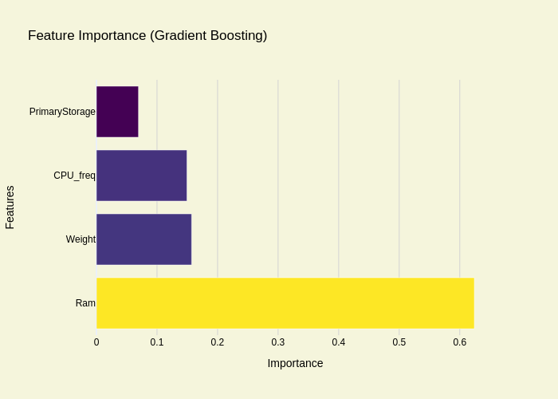

# Laptop Price Prediction Project

This project focuses on analyzing and predicting laptop prices using machine learning models. It includes data preprocessing, exploratory data analysis, and building models like Linear Regression, Random Forest, and Gradient Boosting. Visualizations are included to illustrate key findings and model performance.

---

## **Project Overview**
- **Repository:** [Laptop_Price_Prediction](https://github.com/NoellaButi/Laptop_Price_Prediction)
- **Dataset Location:** `dataset/` folder
- **Goal:** Predict laptop prices based on their specifications.
- **Tech Stack:** Python, Scikit-learn, Plotly, Pandas, NumPy.

---

## **Visualizations**
### **1. Distribution of Laptop Features**
- **Description:** Histograms of key numerical features such as RAM, Weight, CPU Frequency, and Price.
- [Interactive Histogram (HTML)](Visualizations/histogram_features.html)
- 

### **2. Box Plot for Detecting Outliers**
- **Description:** Box plots to identify outliers in features like RAM, Weight, CPU Frequency, and Price.
- [Interactive Box Plot (HTML)](Visualizations/box_plot_outliers.html)
- 

### **3. Correlation Heatmap**
- **Description:** Heatmap showing correlations between key numerical features.
- [Interactive Correlation Heatmap (HTML)](Visualizations/correlation_heatmap.html)
- 

### **4. Predicted vs Actual Prices (Linear Regression)**
- **Description:** Scatter plot comparing actual and predicted prices for the Linear Regression model.
- [Interactive Scatter Plot (HTML)](Visualizations/predicted_vs_actual_lr.html)
- 

### **5. Predicted vs Actual Prices (Random Forest & Gradient Boosting)**
- **Description:** Scatter plot comparing actual and predicted prices for Random Forest and Gradient Boosting models.
- [Interactive Scatter Plot (HTML)](Visualizations/predicted_vs_actual_rf_gb.html)
- 

### **6. Feature Importance (Gradient Boosting)**
- **Description:** Horizontal bar plot showing the importance of features in the Gradient Boosting model.
- [Interactive Horizontal Bar Plot (HTML)](Visualizations/feature_importance_gb.html)
- 

---

## **Setup**
### **Requirements**
- Python 3.x
- Libraries: `pandas`, `numpy`, `plotly`, `scikit-learn`

### **Steps to Run**
1. Clone this repository:
   ```bash
   git clone https://github.com/NoellaButi/Laptop_Price_Prediction.git
   cd Laptop_Price_Prediction
   ```
2. Install required libraries:
   ```bash
   pip install -r requirements.txt
   ```
3. Open the notebook or script and run the analysis.

---

## **Dataset**
- The dataset is stored in the `dataset/` folder.
- Originally sourced from Kaggle.

---

## **License**
This project is licensed under the MIT License. See the [LICENSE](LICENSE) file for details.

---

## **Acknowledgments**
- Dataset source: Kaggle.
- Inspired by projects in the machine learning community.
